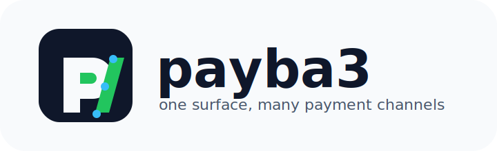

<p align="center">
  
</p>

<p align="center">
  One payment integration surface for many payment channels.
</p>

<p align="center">
  <a href="./LICENSE">License</a>
  ·
  <a href="./CONTRIBUTING.md">Contributing</a>
  ·
  <a href="./SECURITY.md">Security</a>
  ·
  <a href="./SUPPORT.md">Support</a>
</p>

# payba3

payba3 is an open-source collection of payment-channel integrations built for developers, teams, codebases, automations, and AI agents that need a simple way to plug into different payment providers.

Configure the provider you want, select it through payba3, and call the channel.

```ts
const paystack = payba3.use('paystack');

await paystack.initializeOneTimeCheckout({
  email: 'customer@example.com',
  amountInKobo: 500000,
  currency: 'NGN',
});
```

payba3 is growing. More providers, methods, adapters, and examples will be added over time.

## About

Modern products rarely stay tied to one payment provider forever. A team may start with one checkout provider, add virtual accounts later, route a payout through another provider, run identity checks with a verification API, and still need a clean way for application code, scripts, background jobs, and AI agents to call those channels without learning every provider from scratch.

payba3 is a developer-friendly payment integration layer for that reality. It gives each provider a named channel, keeps provider credentials in configuration, and exposes direct methods for common actions such as checkout, virtual accounts, transfers, subaccounts, account linking, and identity checks.

Use payba3 when you want:

- One dependency for multiple payment and verification providers.
- A simple provider selector: `payba3.use('provider')`.
- Provider-specific methods without rewriting authentication and token-refresh logic.
- A project that can be used by normal application code, workflow automations, scripts, and AI agents.
- A growing open-source base where more providers can be added over time.

## Supported Channels

| Channel | Common use cases | Provider signup | Provider docs |
| --- | --- | --- | --- |
| Paystack | Checkout, subscriptions, transfers, dedicated accounts | [Create account](https://paystack.com/developers) | [Docs](https://paystack.com/docs/api/) |
| Safehaven | Virtual accounts, subaccounts, banking APIs | [Sandbox](https://online.sandbox.safehavenmfb.com) | [Docs](https://safehavenmfb.readme.io/reference/introduction) |
| SeerBit | Collections, virtual accounts, online payments | [Create account](https://www.seerbit.com/developers) | [Docs](https://doc.seerbit.com/) |
| OPay | Checkout, signed payment APIs, refunds | [Merchant dashboard](https://merchant.opaycheckout.com) | [Docs](https://doc.opaycheckout.com/payment-authentication) |
| Mono | Open banking, account linking, DirectPay, lookup | [Create account](https://mono.co/signup) | [Docs](https://docs.mono.co/docs/quickstart) |
| Monnify | Checkout, reserved accounts, transfers, wallets | [Create account](https://app.monnify.com/create-account) | [Docs](https://developers.monnify.com/docs/collections/quickstart) |
| QoreID | KYC, CAC lookup, identity verification | [Create account](https://dashboard.qoreid.com/dashboard) | [Docs](https://docs.qoreid.com/) |

## Installation

```bash
npm install @grtsnx/payba3
```

```bash
yarn add @grtsnx/payba3
```

```bash
pnpm add @grtsnx/payba3
```

```bash
bun add @grtsnx/payba3
```

payba3 ships compiled JavaScript, TypeScript declarations, and an npm exports map. It is tested with npm and Bun install smoke checks in CI. Yarn and pnpm can consume the same npm package metadata.

### Runtime Requirements

payba3 is Nest-native today. The core Nest runtime packages are peer dependencies so Nest applications do not end up with duplicate Nest runtimes.

Most modern package managers install peer dependencies automatically or show a clear peer warning. Existing Nest apps usually already have these packages. Only install them manually if your package manager asks for them:

```bash
npm install @nestjs/common @nestjs/core @nestjs/config reflect-metadata rxjs
```

If you want payba3 without Nest at all, that should be a separate framework-neutral package layer, for example `@grtsnx/payba3-core`, with this package acting as the Nest adapter. Keeping the current package Nest-native is intentional for `1.x`.

If you are using the repository directly:

```bash
bun install
```

## Quick Usage

Register payba3 in your application, then use `Payba3Service` to select a channel.

```ts
import { Payba3Service } from '@grtsnx/payba3';

export class Payments {
  constructor(private readonly payba3: Payba3Service) {}

  async collectWithPaystack() {
    return this.payba3.use('paystack').initializeOneTimeCheckout({
      email: 'customer@example.com',
      amountInKobo: 250000,
      currency: 'NGN',
      reference: 'order_123',
    });
  }

  async createSafehavenSubAccount() {
    return this.payba3.use('safehaven').createSubAccount({
      phoneNumber: '08000000000',
      identityType: 'vID',
      identityId: 'identity-id',
      emailAddress: 'customer@example.com',
      externalReference: 'customer_123',
    });
  }
}
```

You can also use a channel directly when you want provider-specific methods:

```ts
await monnify.createReservedAccount({
  accountReference: 'customer_123',
  accountName: 'Jane Doe',
  customerName: 'Jane Doe',
  customerEmail: 'jane@example.com',
  bvn: '00000000000',
});
```

## Configuration

Only configure the providers you use. Missing credentials for unused providers should not block your application from starting.

### Paystack

```bash
PAYSTACK_ENVIRONMENT=sandbox
PAYSTACK_SECRET_KEY=
PAYSTACK_SECRET_KEY_LIVE=
```

### Safehaven

```bash
SAFEHAVEN_ENVIRONMENT=sandbox
SAFEHAVEN_CLIENT_ID=
SAFEHAVEN_CLIENT_ASSERTION=
SAFEHAVEN_TIMEOUT_MS=10000
```

Switch to production:

```bash
SAFEHAVEN_ENVIRONMENT=live
```

### SeerBit

```bash
SEERBIT_ENVIRONMENT=sandbox
SEERBIT_BASE_URL=
SEERBIT_PUBLIC_KEY=
SEERBIT_SECRET_KEY=
SEERBIT_LIVE_PUBLIC_KEY=
SEERBIT_LIVE_SECRET_KEY=
```

### OPay

```bash
OPAY_ENVIRONMENT=sandbox
OPAY_MERCHANT_ID=
OPAY_PUBLIC_KEY=
OPAY_SECRET_KEY=
OPAY_LIVE_MERCHANT_ID=
OPAY_LIVE_PUBLIC_KEY=
OPAY_LIVE_SECRET_KEY=
```

### Mono

```bash
MONO_ENVIRONMENT=sandbox
MONO_SECRET_KEY=
MONO_LIVE_SECRET_KEY=
```

### Monnify

```bash
MONNIFY_ENVIRONMENT=sandbox
MONNIFY_API_KEY=
MONNIFY_SECRET_KEY=
MONNIFY_CONTRACT_CODE=
MONNIFY_LIVE_API_KEY=
MONNIFY_LIVE_SECRET_KEY=
MONNIFY_LIVE_CONTRACT_CODE=
```

### QoreID

```bash
QOREID_ENVIRONMENT=sandbox
QOREID_BASE_URL=
QOREID_CLIENT=
QOREID_SECRET=
QOREID_LIVE_CLIENT=
QOREID_LIVE_SECRET=
```

## Provider Selection

```ts
payba3.use('paystack');
payba3.use('safehaven');
payba3.use('seerbit');
payba3.use('opay');
payba3.use('mono');
payba3.use('monnify');
payba3.use('qoreid');
```

Unsupported providers throw a clear error.

```ts
payba3.use('unknown'); // throws Unsupported payment channel
```

## Token Handling

payba3 refreshes expiring provider tokens before they become stale.

- Safehaven uses `expires_in` from the token response.
- Safehaven stores `ibs_client_id` from the token response for account-call `ClientID` headers.
- QoreID accepts `expiresIn` or `expires_in` from the token response.
- Monnify derives expiry from the JWT `exp` claim when available.

## For AI Agents And Automation

payba3 is intended to be easy for agents, IDE assistants, code generators, and automation workflows to reason about:

- Provider names are explicit.
- Configuration is environment based.
- Request signing and token refresh are handled by payba3.
- Provider-specific actions remain discoverable through named channels.

### Agent Documentation Files

The npm package includes an LLM index and provider-specific reference files. Agents and IDEs can read these files from an installed package instead of scraping source code.

```ts
import { readFileSync } from 'node:fs';
import { createRequire } from 'node:module';

const require = createRequire(import.meta.url);

const indexPath = require.resolve('@grtsnx/payba3/llms.txt');
const paystackPath = require.resolve('@grtsnx/payba3/llms/paystack.txt');

const payba3Guide = readFileSync(indexPath, 'utf8');
const paystackGuide = readFileSync(paystackPath, 'utf8');
```

Available provider docs:

```text
@grtsnx/payba3/llms.txt
@grtsnx/payba3/llms/paystack.txt
@grtsnx/payba3/llms/safehaven.txt
@grtsnx/payba3/llms/seerbit.txt
@grtsnx/payba3/llms/opay.txt
@grtsnx/payba3/llms/mono.txt
@grtsnx/payba3/llms/monnify.txt
@grtsnx/payba3/llms/qoreid.txt
```

### IDE And Agent Workflow

For IDEs, coding agents, and internal app generators:

1. Install `@grtsnx/payba3`.
2. Read `@grtsnx/payba3/llms.txt`.
3. Read the provider file for the requested channel.
4. Generate server-side code that imports from `@grtsnx/payba3`.
5. Ask the developer for only the provider environment variables they need.
6. Keep secrets on the server and verify provider callbacks before delivering value.

Example prompt for an IDE agent:

```text
Use @grtsnx/payba3 to add Paystack checkout.
Read @grtsnx/payba3/llms.txt and @grtsnx/payba3/llms/paystack.txt first.
Only add server-side code.
Use PAYSTACK_SECRET_KEY from the environment.
Verify transactions server-side before marking an order paid.
```

For AI tool servers, expose small provider actions instead of exposing raw secrets:

```ts
import { Payba3Service, type Payba3ChannelName } from '@grtsnx/payba3';

type PaymentToolInput = {
  channel: Payba3ChannelName;
  action: 'initializeCheckout' | 'verifyTransaction';
  payload: Record<string, unknown>;
};

export class PaymentTool {
  constructor(private readonly payba3: Payba3Service) {}

  async run(input: PaymentToolInput) {
    const provider = this.payba3.use(input.channel);

    if (input.channel === 'paystack' && input.action === 'initializeCheckout') {
      return provider.initializeOneTimeCheckout({
        email: String(input.payload.email),
        amountInKobo: Number(input.payload.amountInKobo),
        reference: String(input.payload.reference),
      });
    }

    throw new Error('Unsupported payment tool action');
  }
}
```

## Contributor Checks

```bash
bun install --frozen-lockfile
bun run lint
bun run test
bun run test:providers
bun run test:e2e
bun run build
bun run pack:dry
bun run test:package
bun run test:package:bun
bun audit
```

## Contributing

payba3 welcomes provider additions, method coverage, docs, tests, examples, and security hardening.

Read [CONTRIBUTING.md](./CONTRIBUTING.md) before opening a pull request.

## Security

Do not open public issues for vulnerabilities. Read [SECURITY.md](./SECURITY.md) for supported reporting channels and safe disclosure guidance.

## License

MIT. See [LICENSE](./LICENSE).
